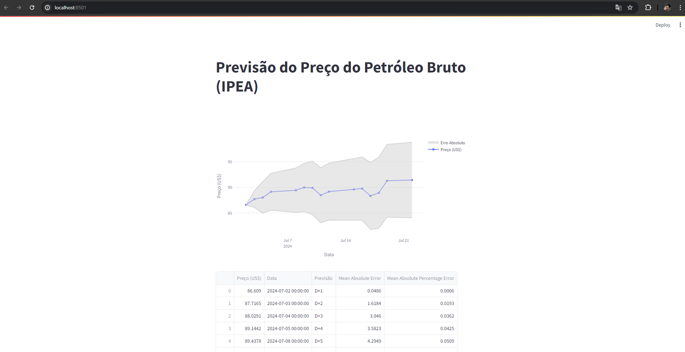

# ML para Séries Temporais

Esse repo é parte do [**Hands-on de ML para Séries Temporais**](https://plbalmeida.gitbook.io/fiap-hands-on-de-ml-para-series-temporais) dos cursos de Pós Tech da FIAP de Engenharia de MLe Data Analytics.

A solução consiste em uma arquitetura com as seguintes componentes:

- componente `model_training` para obtenção dos dados de preço do petróleo bruto do IPEA, transformação dos dados, treino do modelo, e geração de 1 arquivo com previsões, e 1 arquivo com Importência de Features;

- a componente `streamlit` consome os dados de previsão gerados pelo `model_training` e gera visualizações dos mesmos que pode ser acessada localmente por uma URL fornecida nos logs de execução. 

O projeto foi desenvolvido com a seguinte stack:

- `Python`: para criação dos scripts e implementação da solução utilizando as bibliotecas `sci-kit learn`, `pandas`, `matplotlib`, `altair`, entre outras;

- `Docker`: para containerizar a solução;

- `git`: para versionamento de código;

- `GitHub Actions`: para esteira de CI;

Estrutura do repo:

```bash
.
├── Dockerfile
├── README.md
├── docker-compose.yml
├── model_training
│   └── main.py
├── notebooks
│   ├── case.ipynb
│   └── nivelamento_tecnico.ipynb
├── requirements.txt
├── src
│   ├── __init__.py
│   ├── feature_engineer.py
│   ├── model_train.py
│   └── utils.py
├── streamlit
│   ├── app.py
│   ├── importance_df.csv
│   └── preds_df.csv
└── tests
    ├── feature_engineer_test.py
    ├── model_train_test.py
    └── utils_test.py
```

Para executar a aplicação, na raíz do depositório executar:

```bash
docker-compose up --build
```

O script `model_training/main.py` para de treino do modelo será executado primeiro.

<div align="center">
  <figure>
    
  </figure>
</div>

Após a conclusão da execução do script de treino e previsões, dois arquivos serão persistidos no diretório `streamlit`, que são `importance_df.csv` com a Importância de Features obtida com o treino do modelo, e o `preds_df.csv` com as previsões do preço do petróleoe respectivos erros, ambos são insumos para a aplicação do Streamlit.

Acessando a URL fornecida podemos ver o gráfico com as previsões:

<div align="center">
  <figure>
    
  </figure>
</div>

A tabela com as previsões:

<div align="center">
  <figure>
    
  </figure>
</div>

E o gráfico com importância de features:

<div align="center">
  <figure>
    
  </figure>
</div>

## Contribuições

Contribuições são bem-vindas. Para contribuir, por favor, crie um pull request para revisão.